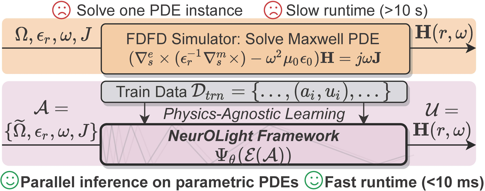
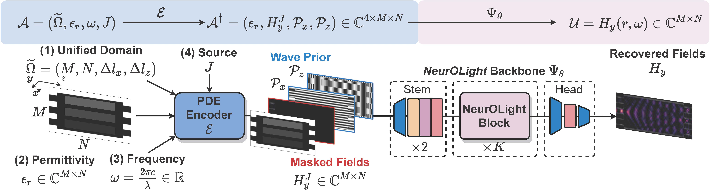
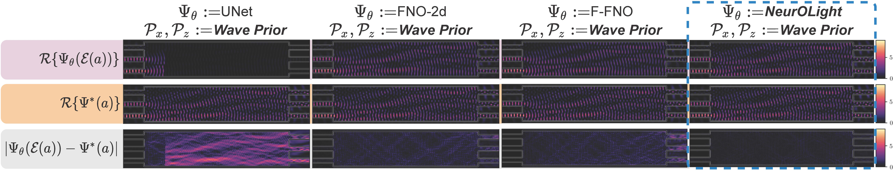

# NeurOLight

By [Jiaqi Gu](https://github.com/JeremieMelo), [Zhengqi Gao](https://github.com/zhengqigao), [Chenghao Feng](https://github.com/Fengchenghao1996), [Hanqing Zhu](https://github.com/zhuhanqing), Ray T. Chen, Duane S. Boning and David Z. Pan.

This repo is the official implementation of "[NeurOLight: A Physics-Agnostic Neural Operator Enabling Parametric Photonic Device Simulation](https://arxiv.org/abs/2209.10098)".

<p align="left">
    <a href="https://github.com/JeremieMelo/pytorch-onn/blob/release/LICENSEE">
        
    </a>    
</p>
<br />

# Introduction
**NeurOLight** is a physics-agnostic neural operator-based framework to enable ultra-fast parametric integrated photonic device simulation.
<!-- <p align="center">
  

</p> -->

**NeurOLight** learns a family of frequency-domain Maxwell PDEs to predict the light field insides integrated photonic devices.
We discretize different devices into a unified domain, represent parametric PDEs with a compact wave prior, and encode the incident light via masked source modeling. 
**NeurOLight** is designed with parameter-efficient cross-shaped NeurOLight blocks and adopts superposition-based augmentation for data-efficient learning.


**NeurOLight** generalizes to a large space of unseen simulation settings, demonstrates **2-orders-of-magnitude faster simulation** speed than numerical solvers, and outperforms prior neural network models by **~54% lower prediction error** with ~44% fewer parameters.
<p align="center">
  
</p>
<p align="center">
  
</p>


# Dependencies
* Python >= 3.6
* pyutils >= 0.0.1. See [pyutils](https://github.com/JeremieMelo/pyutility) for installation.
* pytorch-onn >= 0.0.5. See [pytorch-onn](https://github.com/JeremieMelo/pytorch-onn) for installation.
* Python libraries listed in `requirements.txt`
* NVIDIA GPUs and CUDA >= 10.2

# Structures
* configs/: configuration files
* core/
    * models/
        * layers/
            * neurolight_conv2d: NeurOLight block definition
            * fno_conv2d: FNO block definition
            * factorfno_conv2d: Factorized-FNO block definition
        * neurolight_cnn.py: NeurOLight model definition
        * fno_cnn.py: FNO model definition
        * factorfno_cnn.py: Factorized-FNO (F-FNO) model definition
        * unet.py: UNet-2d model definition
        * pde_base.py: base model definition
        * utils.py: utility functions
        * constant.py: constant definition
    * builder.py: build training utilities
    * utils.py: customized loss function definition
* scripts/: contains experiment scripts
* data/: MMI simulation dataset
* train.py: training logic
* test.py: inference logic
* tune.py: transfer and finetune logic

# Usage
* 3x3 tunable MMI dataset simulation and raw dataset generation (Optional). `DATASET` need to be replaced by one option from (`mmi3x3`, `mmi4x4`, `mmi5x5`, `mmi3x3_etched`)\
`data/mmi/> python3 make_dataset.py DATASET`

* Train `MODEL` on 3x3 tunable MMI datasets, replace `MODEL` with one option from (`neurolight`, `fno`, `factorfno`, `unet`),\
`> python3 scripts/mmi/MODEL/train_random_tunable.py`
* Or, train `MODEL` on 3x3 etched MMI datasets, replace `MODEL` with one option from (`neurolight`, `fno`, `factorfno`, `unet`),\
`> python3 scripts/mmi/MODEL/train_random_etched.py`
* Test the trained model on test simulation instances with the single-shot multi-source mode. (Need to modify the path to trained checkpoint in the script).
`python3 scripts/mmi/MODEL/test_main_results.py`

* Checkpoints for 12-layer NeurOLight on tunable MMIs and 16-layer NeurOLight on etched MMIs are available at [link](https://arizonastateu-my.sharepoint.com/:f:/g/personal/jiaqigu_asurite_asu_edu/Ei0mWS6CJrNEkojLGbAF-kwBwXZ4fpJi0PIOS1cI0SjrrQ?e=X9jMnB)
* Simulation dataset for Tunable MMI and etched MMI are available at [link](https://arizonastateu-my.sharepoint.com/:f:/g/personal/jiaqigu_asurite_asu_edu/EpQ8RWFNWDJOloFudgcmwiIB5ENvNhWsK_yxjFa_WD5apA?e=T7MAn8). Unzip it and place all `*.pt` under `data/mmi/raw/*.pt`.

# Citing NeurOLight
```
@inproceedings{gu2022NeurOLight,
  title={NeurOLight: A Physics-Agnostic Neural Operator Enabling Parametric Photonic Device Simulation},
  author={Jiaqi Gu and Zhengqi Gao and Chenghao Feng and Hanqing Zhu and Ray T. Chen and Duane S. Boning and David Z. Pan},
  booktitle={Conference on Neural Information Processing Systems (NeurIPS)},
  year={2022}
}
```
